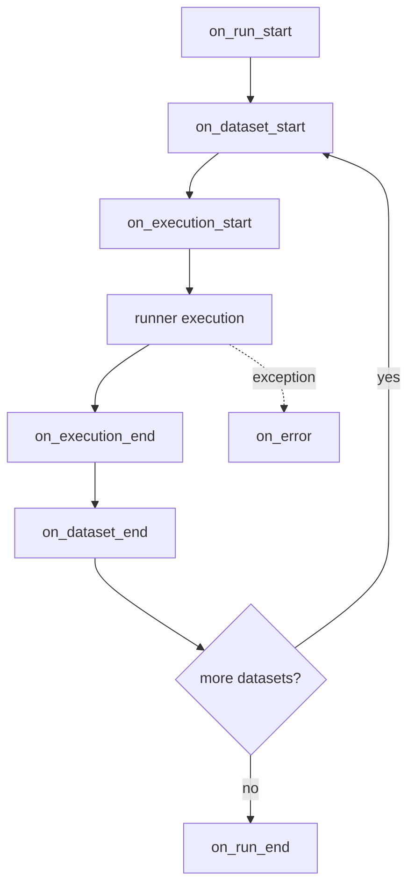

# Configuration

Coleman uses **YAML configuration files** with typed
[Pydantic v2](https://docs.pydantic.dev/) models for validation.  Configs
are loaded via `load_spec()` (library) or `coleman --config` (CLI).

For `coleman sweep`, the same YAML file may also include a top-level
`sweep` section. This section is used only by sweep commands.

## Configuration file format

A configuration file is a YAML document whose top-level keys map directly
to the sections of `RunSpec`:

```yaml
# my-experiment.yaml

execution:
  parallel_pool_size: 4
  independent_executions: 30
  seed: 42                     # optional — deterministic RNG seed
  verbose: false
  force_sequential_under_scalene: true

experiment:
  scheduled_time_ratio: [0.1, 0.5, 0.8]
  datasets_dir: examples
  datasets:
    - alibaba@druid
  experiment_dir: results/experiments/
  rewards:
    - RNFail
    - TimeRank
  policies:
    - UCB
    - FRRMAB
    - LinUCB

# Note: the list above is an example, not an exhaustive list of available policies.
# See the policy API reference for the complete set.

algorithm:
  ucb:
    rnfail:
      c: 0.5
  frrmab:
    window_sizes: [50, 100, 200]
  linucb:
    rnfail:
      alpha: 0.5

hcs_configuration:
  wts_strategy: false

contextual_information:
  config:
    previous_build: [Duration, NumRan, NumErrors]
  feature_group:
    feature_group_name: time_execution
    feature_group_values: [Duration, NumErrors]

results:
  enabled: true
  sink: parquet               # "parquet" (default), "duckdb" or "clickhouse"
  out_dir: ./runs
  batch_size: 1000
  top_k_prioritization: 0    # 0 = hash only
  manifest_enabled: false    # true = write manifest.json under each run_id
  duckdb:
    file_count: 1
    base_name: results
    shard_key: execution_id

checkpoint:
  enabled: true
  interval: 50000
  base_dir: checkpoints

telemetry:
  enabled: false
  otlp_endpoint: http://localhost:4318
  service_name: coleman
  export_interval_millis: 5000

hooks:
  fail_fast: false
  plugins:
    - my_project.hooks.ForecastHook

extensions:
  my_domain:
    forecast_selection:
      policy: ThompsonSampling
      reward: Binary

sweep:
  axes:
    - mode: grid
      params:
        algorithm.ucb.rnfail.c: [0.1, 0.3, 0.5]
        execution.parallel_pool_size: [1, 4]
  seeds: [0, 1, 2]
```

## RunSpec schema reference

Every configuration file is validated against `RunSpec`, which composes
the following typed sub-specs:

| Section | Model | Key fields |
|---------|-------|------------|
| `execution` | `ExecutionSpec` | `parallel_pool_size`, `independent_executions`, `seed`, `verbose`, `force_sequential_under_scalene` |
| `experiment` | `ExperimentSpec` | `scheduled_time_ratio`, `datasets_dir`, `datasets`, `experiment_dir`, `rewards`, `policies` |
| `algorithm` | `AlgorithmSpec` | Free-form nested dict — any algorithm can store its own parameters |
| `hcs_configuration` | `HCSConfigurationSpec` | `wts_strategy` |
| `contextual_information` | `ContextualInformationSpec` | `config` (previous build columns), `feature_group` |
| `results` | `ResultsSpec` | `enabled`, `sink`, `out_dir`, `batch_size`, `top_k_prioritization`, `manifest_enabled`, `duckdb`, `clickhouse` |
| `checkpoint` | `CheckpointSpec` | `enabled`, `interval`, `base_dir` |
| `telemetry` | `TelemetrySpec` | `enabled`, `otlp_endpoint`, `service_name`, `export_interval_millis` |
| `hooks` | `HooksSpec` | `fail_fast`, `plugins` |
| `extensions` | `dict[str, Any]` | namespaced custom config passthrough |

`sweep` is not part of `RunSpec`; it is a CLI-level extension consumed by
`coleman sweep`.

## Parallelism model

Coleman supports two independent parallelism layers:

1. **Intra-run process pool** via `execution.parallel_pool_size`.
  This controls how many worker processes execute one run's
  `independent_executions`.
2. **Inter-spec concurrency** via `coleman sweep --workers` (or API
  `run_many(..., max_workers=...)`). This controls how many different
  resolved specs run at the same time.

When Scalene profiling is active, `force_sequential_under_scalene: true`
forces intra-run pool size to `1` for profiling stability.

## Policy and reward name resolution

`experiment.policies` and `experiment.rewards` are resolved case-insensitively.

Supported wildcard aliases:

1. `*`
2. `all`

Unknown names are ignored with warnings and reported before execution starts.

## Runner hooks and extensions

Coleman supports custom domain workflows via two top-level sections:

1. `extensions`: namespaced custom config passed to hook contexts.
2. `hooks`: lifecycle plugins loaded from dotted paths.

### Hook registration

```yaml
hooks:
  fail_fast: false
  plugins:
    - my_project.hooks.ForecastHook
    - my_project.hooks.audit_hook
```

Supported plugin symbols:

1. Class (instantiated with no arguments).
2. Function with signature `(event_name, context, payload=None)`.

### Lifecycle events

Hook methods are optional. Coleman dispatches these events in order:

1. `on_run_start(context)`
2. `on_dataset_start(context)`
3. `on_execution_start(context)`
4. `on_execution_end(context, execution_result)`
5. `on_dataset_end(context, dataset_result)`
6. `on_run_end(context, run_result)`
7. `on_error(context, error)`

`on_error` is also dispatched when execution startup or environment
construction fails, using the most specific available context.

### Execution contract (sequential vs parallel)

1. `on_run_*` and `on_dataset_*` execute in the coordinator process.
2. `on_execution_*` execute in the worker process context.
3. In sequential mode, worker and coordinator are the same process, but the event contract is unchanged.
4. Hook plugin loading in workers is path-based and process-local to keep multiprocessing pickle-safe.

### Error handling (`fail_fast`)

1. `fail_fast: true` (default): hook exceptions stop execution.
2. `fail_fast: false`: hook exceptions are logged with run/dataset/execution identifiers and execution continues.

### Hook context and payloads

`HookContext` includes stable identifiers and execution metadata:

1. `run_id`
2. `dataset_id`
3. `execution_id`
4. `worker_id`
5. `parallel_mode`
6. `iteration`, `trials`, `sched_time_ratio`
7. `extensions`

Event payloads:

1. `ExecutionResult(status, duration_seconds)`
2. `DatasetResult(status, executions, duration_seconds)`
3. `RunResult(status, datasets, duration_seconds)`

### Lifecycle diagram



### Minimal end-to-end config

```yaml
packs:
  - execution/default
  - experiment/alibaba_druid
  - algorithm/defaults
  - reward/rnfail
  - results/parquet

execution:
  independent_executions: 10
  parallel_pool_size: 4

hooks:
  fail_fast: false
  plugins:
    - my_project.hooks.ForecastHook

extensions:
  my_domain:
    forecast_selection:
      policy: ThompsonSampling
      reward: Binary
```

For a complete extension guide including custom Policy/Reward and source-level
Environment/EvaluationMetric customization paths, see
[Extensibility & Parallelism](extensibility.md).

All fields have sensible defaults.  A minimal config only needs to specify
the settings you want to override:

```yaml
# minimal.yaml — everything else uses defaults
experiment:
  datasets: ["alibaba@druid"]
  policies: ["UCB"]
  rewards: ["RNFail"]
```

## Config packs

**Config packs** are small, composable YAML fragments stored under
`packs/<category>/<name>.yaml`.  Reference them with the `packs` key:

```yaml
# experiment-with-packs.yaml
packs:
  - policy/linucb
  - reward/rnfail
  - results/parquet
  - telemetry/off

experiment:
  datasets: ["alibaba@druid"]

execution:
  independent_executions: 30
```

### Resolution order

1. Packs are loaded left-to-right and **deep-merged** (nested dicts are
   merged recursively; scalar values from later packs win).
2. Inline keys from the user config are applied **on top** as final
   overrides.
3. The merged dict is validated against `RunSpec`.

### Shipped packs

| Pack | Category | Description |
|------|----------|-------------|
| `policy/linucb` | Policy | LinUCB with default alpha values |
| `reward/rnfail` | Reward | RNFail reward function |
| `runtime/local` | Runtime | Single-process local execution |
| `results/parquet` | Results | Parquet sink with defaults |
| `results/duckdb` | Results | DuckDB sink with consolidated files |
| `telemetry/off` | Telemetry | Telemetry disabled |

### DuckDB sink configuration

Use `results.sink: duckdb` to write results directly into one or more DuckDB files.

```yaml
results:
  enabled: true
  sink: duckdb
  out_dir: ./runs
  batch_size: 1000
  duckdb:
    file_count: 1         # default: single consolidated .duckdb file
    base_name: results    # output: results.duckdb (or results_000.duckdb, ...)
    shard_key: execution_id
```

`file_count` allows partitioning writes across multiple DuckDB files when desired.

### Creating custom packs

Add a YAML file under `packs/<category>/<name>.yaml` with any subset of
`RunSpec` fields.  For example, a custom policy pack:

```yaml
# packs/policy/my-ucb.yaml
experiment:
  policies:
    - UCB

algorithm:
  ucb:
    rnfail:
      c: 0.3
    timerank:
      c: 0.3
```

## Sweep engine

The **sweep engine** generates multiple `RunSpec` instances from a single
base config by expanding parameter ranges.  Two modes are supported:

### Grid mode (Cartesian product)

Every combination of parameter values is generated:

```python
from coleman.spec import RunSpec, SweepSpec, SweepAxis, expand_sweep

base = RunSpec(experiment={"datasets": ["alibaba@druid"], "policies": ["UCB"]})
sweep_spec = SweepSpec(
    axes=[SweepAxis(mode="grid", params={
        "algorithm.ucb.rnfail.c": [0.1, 0.3, 0.5],
        "execution.parallel_pool_size": [1, 4],
    })],
)
specs = expand_sweep(base, sweep_spec)
# 3 × 2 = 6 specs
```

### Zip mode (paired lists)

Parameter lists are paired element-wise.  All lists **must** have equal
length — a `ValueError` is raised otherwise:

```python
sweep_spec = SweepSpec(
    axes=[SweepAxis(mode="zip", params={
        "algorithm.ucb.rnfail.c": [0.1, 0.3, 0.5],
        "algorithm.ucb.timerank.c": [0.2, 0.4, 0.6],
    })],
)
specs = expand_sweep(base, sweep_spec)
# 3 paired specs
```

### Seed replication

Add `seeds` to replicate each generated spec once per seed.  The seed is
stored on `execution.seed` and affects the `run_id`:

```python
sweep_spec = SweepSpec(
    axes=[SweepAxis(mode="grid", params={"algorithm.ucb.rnfail.c": [0.1, 0.5]})],
    seeds=[0, 1, 2],
)
specs = expand_sweep(base, sweep_spec)
# 2 values × 3 seeds = 6 specs, each with a unique run_id
```

### CLI sweep

```bash
# Uses top-level sweep section from base.yaml (if present)
coleman sweep --config base.yaml --workers 4

# Add/override an extra grid dimension from CLI
coleman sweep --config base.yaml \
    --grid algorithm.ucb.rnfail.c=0.1,0.3,0.5 \
    --grid execution.seed=range(0,20) \
    --workers 4

# Dry-run to preview generated specs
coleman sweep --config base.yaml \
    --grid execution.seed=range(0,5) \
    --dry-run
```

If both YAML `sweep.axes` and CLI `--grid` are provided, Coleman merges
them and computes the Cartesian product across all axes.

If both sources define the same dotted key, the sweep is rejected with a
`ValueError` instead of silently creating duplicate combinations.

## Deterministic run_id

Every `RunSpec` produces a **deterministic 12-character identifier**:

```
run_id = sha256(canonical_json(resolved_spec))[:12]
```

The canonical JSON uses sorted keys and compact separators so that the
**same logical config always yields the same `run_id`**, regardless of
field insertion order.

Artifacts are written to `<out_dir>/<run_id>/`:

```
./runs/
  ddd8bbefa143/
    spec.resolved.json     # fully resolved RunSpec
    provenance.json        # git commit, Python version, uv.lock hash
    results/               # experiment results
    checkpoints/           # crash-recovery state
```

## Provenance

Each run persists provenance metadata alongside results:

| File | Contents |
|------|----------|
| `spec.resolved.json` | The fully resolved `RunSpec` as canonical JSON |
| `provenance.json` | Git commit hash, dirty flag, Python version, `uv.lock` hash |

This enables exact experiment reproduction: given the same `spec.resolved.json`,
the same `run_id` and outputs are produced (within documented constraints such
as floating-point non-determinism across platforms).

## Loading and validating configs

### Library API

```python
from coleman.api import load_spec, save_resolved
from coleman.spec.run_id import compute_run_id

# Load with pack resolution
spec = load_spec("my-experiment.yaml", packs_dir="packs")

# Compute run_id
rid = compute_run_id(spec)
print(f"run_id: {rid}")

# Persist resolved config
save_resolved(spec, f"./runs/{rid}/spec.resolved.json")
```

### CLI

```bash
# Validate a config and print the run_id
coleman validate --config my-experiment.yaml

# Validate and write the resolved spec
coleman validate --config my-experiment.yaml --resolve resolved.json
```
